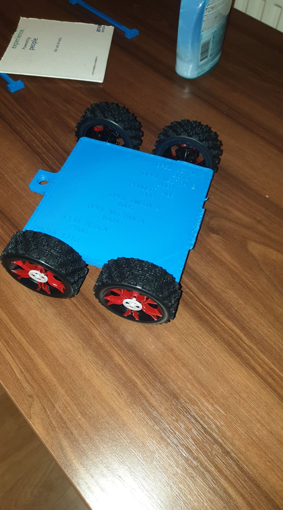

## Welcome to GitHub Pages

You can use the [editor on GitHub](https://github.com/dragos1993/proiecte/edit/main/README.md) to maintain and preview the content for your website in Markdown files.

Whenever you commit to this repository, GitHub Pages will run [Jekyll](https://jekyllrb.com/) to rebuild the pages in your site, from the content in your Markdown files.

### Markdown

Markdown is a lightweight and easy-to-use syntax for styling your writing. It includes conventions for

```markdown
Syntax highlighted code block

# Header 1
 <h3><a href="http://design3d.hopto.org"><h1>Vrei proiect la O.M.2 sau Informatica Aplicata</h1></a></h3><br><br>
## Header 2
### Header 3
<head>
    <meta charset="UTF-8">
    <title>Proiecte</title>
</head>
<body>

    <!--creare bara de navigare-->
    <div class="header">
        <div class="container">
            <div class="logo">
                                
             </div>
        </div>
    </div>
        
                    
                        <h3><a href="http://design3d.hopto.org"><h1>Vrei proiect la O.M.2 sau Informatica Aplicata</h1></a></h3><br><br>
                   <h1> Vrei o asigurare ?? --- 0755/422/527 ------ Adina </h1><br>
                
<br><br>

           <<!--     <h1 style="float:center;">Printare-3D --- 0726/883/794 ------ Dragos </h1>
            <h1> </h1>
                 -->
             </ul>
                     </div>
                </div>
        


</body>
</html>

1. Numbered
2. List

**Bold** and _Italic_ and `Code` text

[Link](url) and 
<div class="header">
        <div class="container">
            <div class="logo">
                                
             </div>
        </div>
    </div>

For more details see [GitHub Flavored Markdown](https://guides.github.com/features/mastering-markdown/).

### Jekyll Themes

Your Pages site will use the layout and styles from the Jekyll theme you have selected in your [repository settings](https://github.com/dragos1993/proiecte/settings). The name of this theme is saved in the Jekyll `_config.yml` configuration file.

### Support or Contact

Having trouble with Pages? Check out our [documentation](https://docs.github.com/categories/github-pages-basics/) or [contact support](https://support.github.com/contact) and we’ll help you sort it out.
